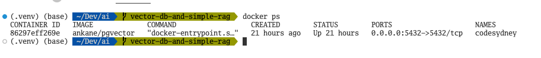
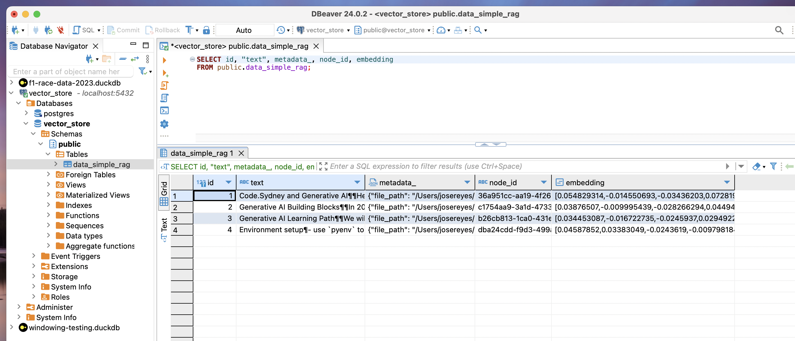

# Module 3 - Vector Databases

## Introduction to Vector Databases

### What is a vector?

A vector is a mathematical object that has both magnitude and direction. Vectors are often used to represent data in machine learning and deep learning models. For example, a vector can represent a word in a text document, a user in a social network, or an image in a computer vision application.

But in practical terms, vectors are nothing but an array of numbers. A list of numbers if we are speaking Python, and that's it. It looks like this:

```python
# A 6-dimensional vector
six_dimension_vector = [0.19593449, 0.10697176, 0.085852444, 0.020550441, 0.21760122, 0.05884677]
```

When people talk about vectors, you will hear the terms, `mathematical representation`, `dimensions`, `smantic search`. Let's try to explain each of these terms that will help us understand the concept of vector databases.

- **Mathematical representation**: A vector is a mathematical representation of an object in a high-dimensional space. Each dimension of the vector corresponds to a feature of the object. For example, a word vector might have dimensions for word frequency, part of speech, and context.

- **Dimensions**: The number of dimensions in a vector is the number of features used to represent an object. A few other synonyms - **latent factors, features, or properties**.  For example, a word vector might have 300 dimensions, with each dimension representing a different aspect of the word.

- **Semantic search**: Semantic search is a search technique that uses the meaning of words to find relevant information. In a vector database, semantic search is performed by comparing the vectors of objects to find the most similar objects. For example, a semantic search engine might return documents that are similar in meaning to a query document.

|| feature 1 (pet) | feature 2 (colour)| feature 3 (size)|
|----------|----------|----------|----------|
| wolf     | 0.97     | 0.38     | 0.8      |
| dog      | 0.97     | 0.38     | 0.6      |
| cat      | 0.93     | 0.93     | 0.5      |
| banana   | 0.23     | 0.63     | 0.1      |
| apple    | 0.25     | 0.43     | 0.1      |
| walk     | 0.05     | 0.02     | 0.0      |

In the example above, we have a **3-dimensional vector space** where each object is represented by a vector with 3 features. The features are not really known but for sake of illustration, we have labelled them as `pet`, `colour` and `size`. The values in the vectors represent the importance of each feature for the object. For example, the vector for `dog` has a high value for `pet`, a low value for `colour`, and a middle value for size, indicating that `dog` is a pet, its colour has a representation closer to the value 0.38, and it is neither too large nor too small.

The value `walk` has a low value for both `pet`, `colour` and `size`. Indicating that it is neither a pet nor has a colour, nor size.

The above table is a simple 3-dimension vector, however in the real world, like in the vector databases we will be using, the vectors are high-dimensional, typically **384**, **768**, **1024** and some embedding models even go up to **4096** dimensions. If you can easily visualise a 3-dimension vector, I find it hard to visualise anything greater than that.


In the image above, there is a input query in natural language - `kitten`, and visually, we can see that its vector representation is close to `cat` and `dog`. This is how semantic search works in a vector database.

## Get to know 2 popular Vector Databases (PgVector and ChromaDB)

There are a multitude of vector databases available in the market. In this module, we will be focusing on two popular vector databases - [PgVector](https://github.com/pgvector/pgvector) and [ChromaDB](https://www.trychroma.com/). 

### Setting up PgVector in a local Docker container

Use the following command to start a PgVector container named `codesydney`. We are using the image `ankane/pgvector` which is a pre-built image for PgVector. The environment variable `POSTGRES_PASSWORD` is used to set the password for the `postgres` user. The `-v` flag is used to mount a volume from the host machine to the container. This is useful for persisting data across container restarts. In this case, we are mounting the `postgres` directory in the current working directory to the `/var/lib/postgresql/data` directory in the container. The `-d` flag is used to run the container in detached mode. The `-p` flag is used to map the container port `5432` to the host port `5432`.

```bash
docker run --name codesydney -e POSTGRES_PASSWORD=mysecretpassword -d -p 5432:5432 -v $(pwd)/postgres:/var/lib/postgresql/data:rw ankane/pgvector
```



### Setting up ChromaDB in a local Docker container

To be completed

### Interactive bash shell 

Connect to the container using the following command:

```
docker exec -it codesydney bash
```

### Connect to Postgres

Once connected, you can connect to the Postgres database using the following command:

```
psql -h localhost -p 5432 -U postgres
```

### Create a database

Finally, you can then create the database using the following command. In this case, we are creating a database named `vector_store`.

```
CREATE DATABASE vector_store;
```

### Connect to the database

Finally, you can connect to the database using the following command:

```
\c vector_store
```

Alternatively, connect to your Postgres database using a GUI tool like [DBeaver](https://dbeaver.io/), [pgAdmin](https://www.pgadmin.org/) or [JetBrains DataGrip](https://www.jetbrains.com/datagrip/) are also a good options.



## Assignment
- Install **Postgres** in your local machine using the **Docker** method mentioned above. You might want to use [Docker Desktop](https://www.docker.com/products/docker-desktop/) to help you manage your containers.
- Copy the [exercise](./1-vector-dbs.ipynb) to `my-notebooks` folder.  Work on it to get familiar with **PgVector** and **LlamaIndex** data ingestion
- Find another **embedding model** from [Hugging Face](https://huggingface.co/models?other=text-embedding) and ingest your own data (find a couple of **your PDF or MD files**).
- Play with different values of `similarity_top_k` to see the effect on your retriever.
