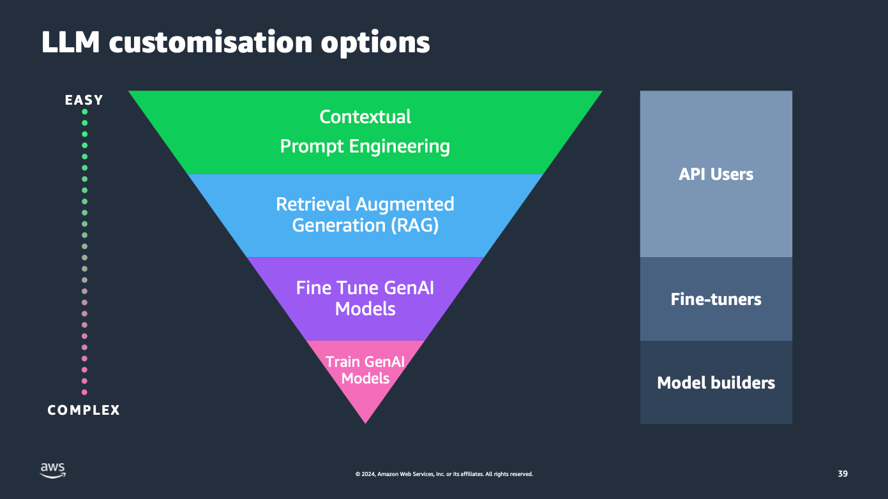
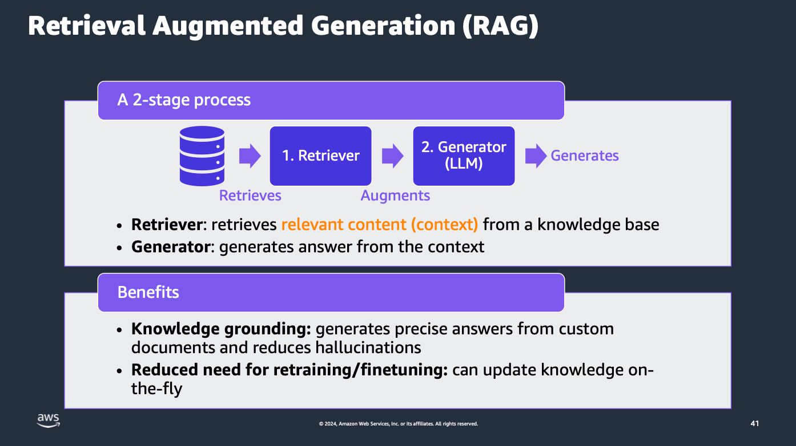
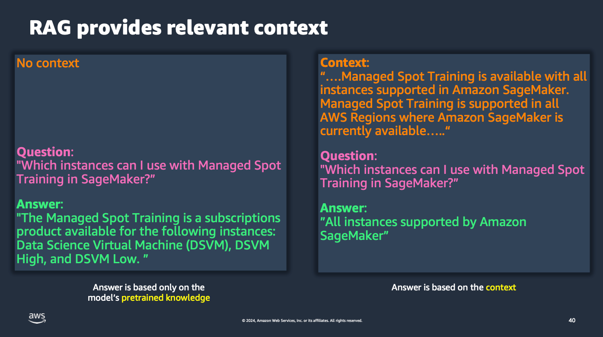
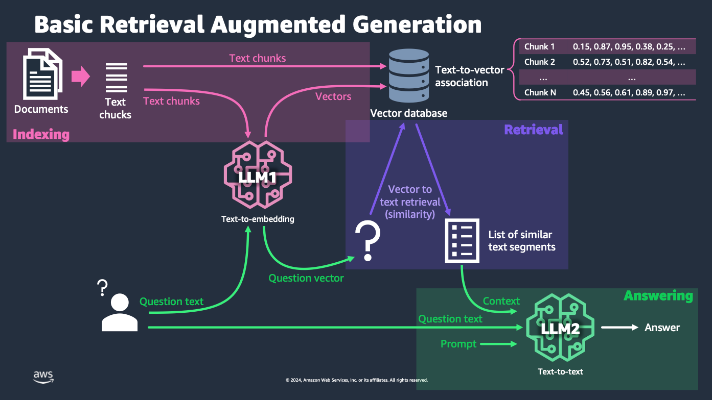
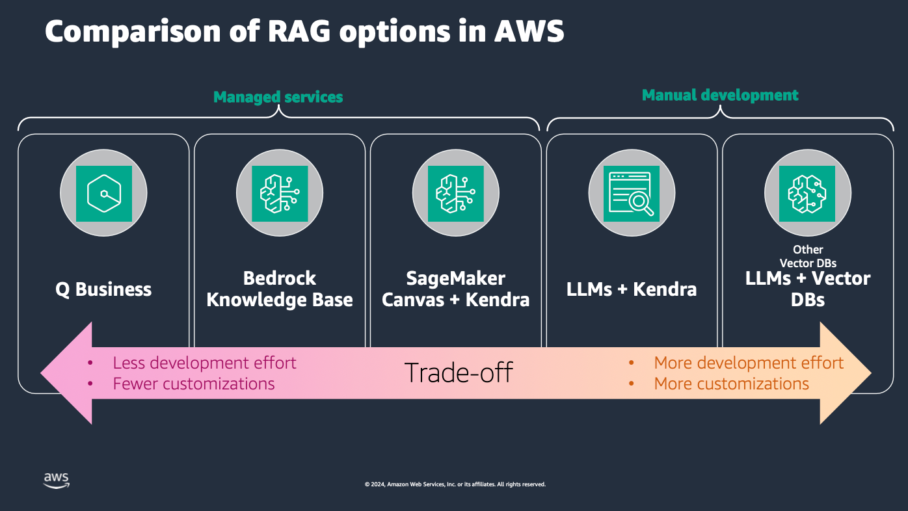

# Module 4 - Retrieval-Augmented Generation (RAG)

## Where does RAG fit in?

## Introducing RAG

## RAG example

## Basic RAG System

## RAG Options is AWS

## Assignment
- Copy [exercise](./basic-rag.ipynb) to the `my-notebooks` folder. 
- Work on this exercise, and experiment with different chunking sizes. Which one is more effective for your use case? How about the chunk overlap?
- Try a out a couple of different embedding models.
- Try out different prompts and see how they affect the output.
- Reflect on the results and report back to the group in the Discord channel.

