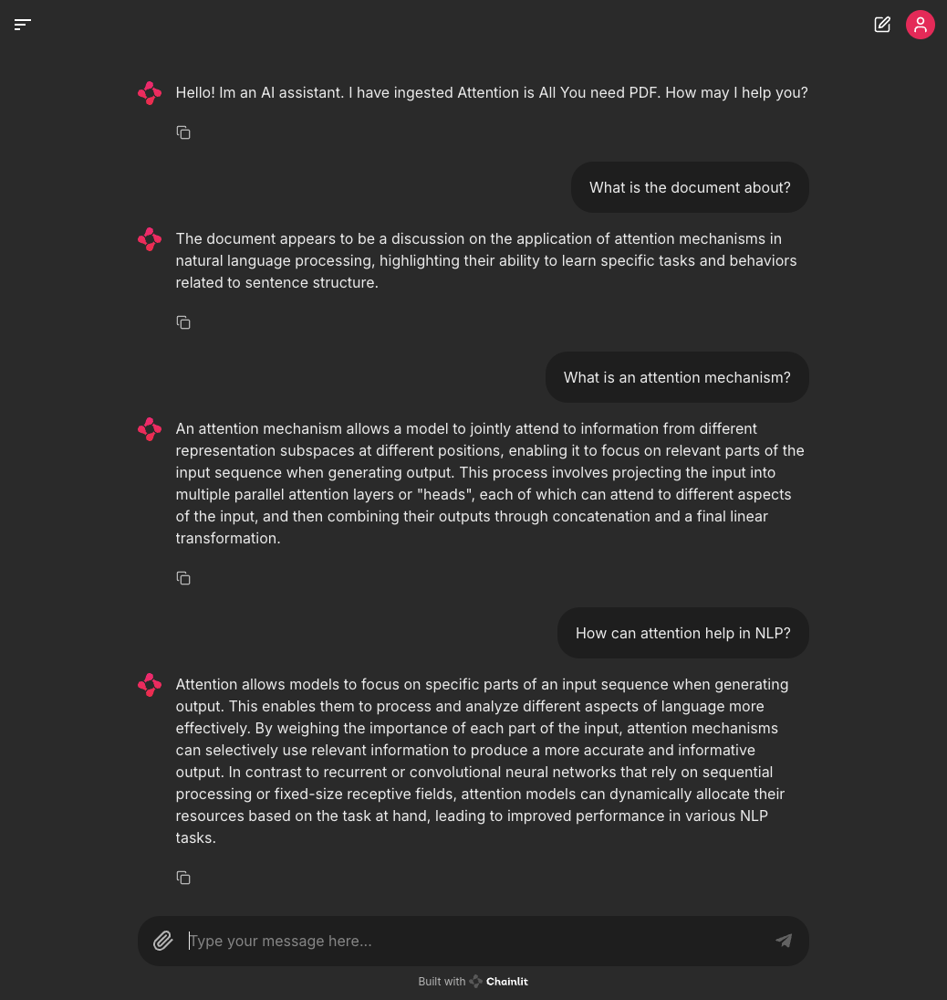

# Module 6 - RAG Application using Chainlit

In this module, we will build a simple full-stack application for our RAG system using Chainlit. Chainlit is a powerful tool designed to help you prototype, debug and share applications built on top of LLMs.



- make sure your local LLM is running on `http://localhost:1234/v1`
- double check that your choice of embedding model
- make sure your Postgres vector database is running on port `5432`

- to run the Chainlit app:

```bash
chainlit run 01-chainlit-frontend.py -w
```

Sample questions you can ask this RAG system:

- What is the document about?
- What is an attention mechanism?
- How can attention help in NLP?
- Give me ten question to ask about this document.
- And so on...  