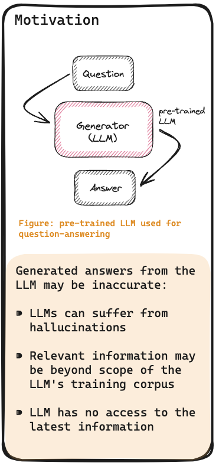
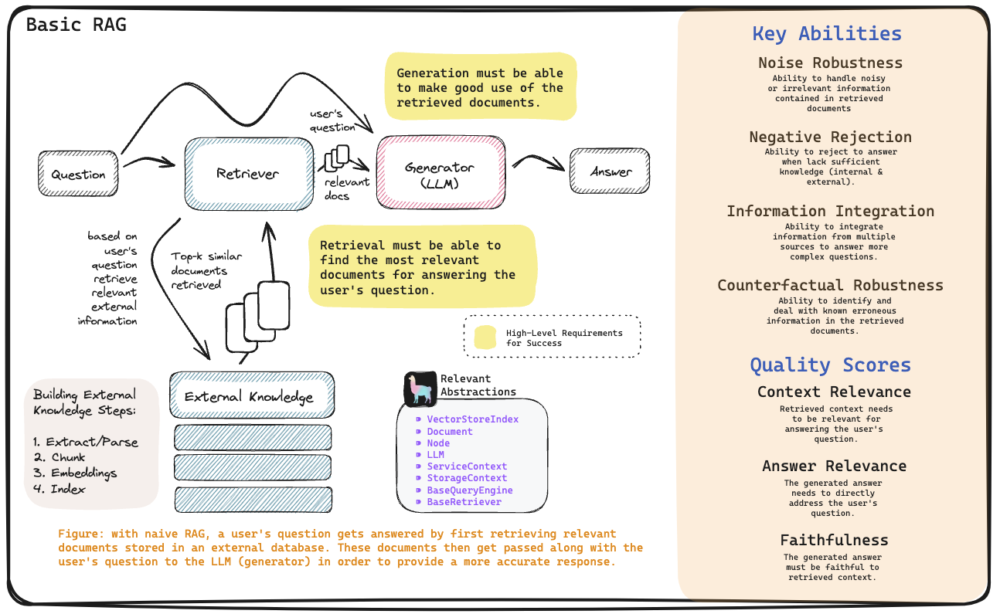
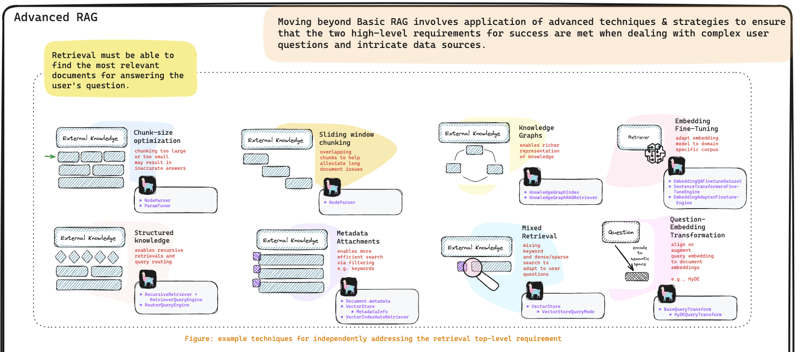
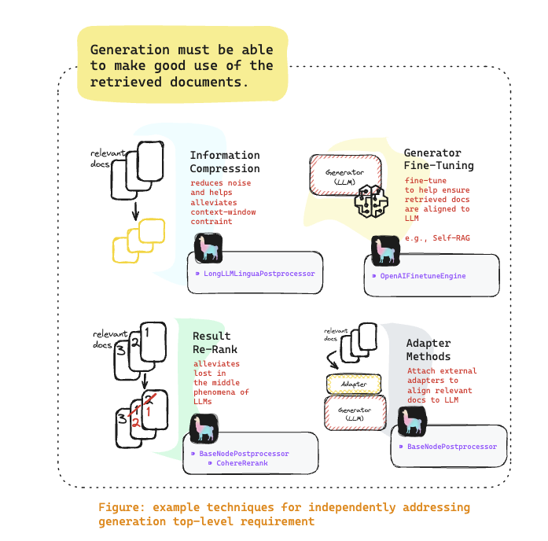
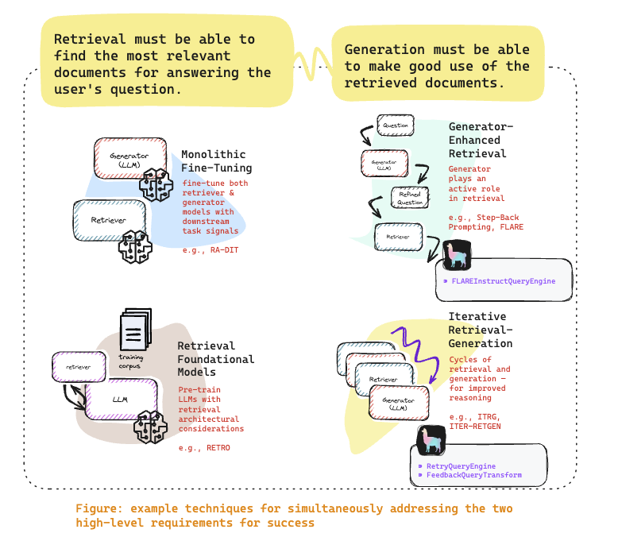

# Module 6 - Advanced RAG (LlamaIndex)

## RAG Motivation

Every week we hear a new LLM model get released and it would almost always be better than any of the predecessors. And that is great, as we can do more and more with these models.

However, as powerful as these models are, they are not perfect as their answers may be inaccurate in certain cases:

- LLMs can suffer from hallucination, where they **generate text that is not grounded in reality**.
- LLMs only know about the **domain knowledge that they have been trained on**. For example, they might not have been exposed to a the legal domain, and so they might not be able to answer legal questions accurately.
- LLMs also **do not have access to the latest information**, as their knowledge is frozen at the time of training.

## Basic RAG

Following is an image I sourced from LlamaIndex but I've cropped it for easier consumption. I have also copied the original [high resolution image here](./images/rag-cheat-sheet-final.svg).

LlamaIndex has the following convention for describing a RAG system:

- **Retriever**: The part the retrieves similar nodes from the vector store.

- **Generator**: the LLM that generates or synthesises the answer from all the text input it has been given.

### Requirements for a successful RAG system

1. **Retriever** must be able to find the most relevant documents/nodes for answering the user's question.

1. **Generator** must be able to make good use of the retrieved documents/nodes to generate the answer.

## RAG Failure points (from [RAG Failure Points](../module-4/data/RAG_Failure_Points.pdf))

**FP1 Missing Content** - The first fail case is when asking a question that cannot be answered from the available documents. In the happy case the RAG system will respond with something like “Sorry, I don’t know". However, for questions that are related to the content but don’t have answers the system could be fooled into giving a response.

**FP2 Missed the Top Ranked Documents** - The answer to the question is in the document but did not rank highly enough to be returned to the user. In theory, all documents are ranked and used in the next steps. However, in practice the top K documents are returned where K is a value selected based on performance.

**FP3 Not in Context - Consolidation strategy Limitations** - Documents with the answer were retrieved from the database but did not make it into the context for generating an answer. This occurs when many documents are returned from the database and a consolidation process takes place to retrieve the answer.

**FP4 Not Extracted** -  Here the answer is present in the context, but the large language model failed to extract out the correct answer. Typically, this occurs when there is too much noise or contradicting information in the context.

**FP5 Wrong Format** - The question involved extracting information in a certain format such as a table or list and the large language model ignored the instruction.

**FP6 Incorrect Specificity** The answer is returned in the response but is not specific enough or is too specific to address the user’s need. This occurs when the RAG system designers have a desired outcome for a given question such as teachers for students. In this case, specific educational content should be provided with answers not just the answer. Incorrect specificity also occurs when users are not sure how to ask a question and are too general.

**FP7 Incomplete** - Incomplete answers are not incorrect but miss some of the information even though that information was in the context and available for extraction. An example question such as “What are the key points covered in documents A, B and C?” A better approach is to ask these questions separately.

## Advanced RAG strategies

### Retrieval Strategies

- **Chunk-size optimisation** - where the current chunking size used may affect the accuracy of the answers. 

- **Structured Knowledge** - where your data is arranged in a hierarchical structure, and that you might need to recurse or route to the correct node in the hierarchy. 

- **Metadata filtering** - where you might have metadata associated with your documents that you can use to filter out irrelevant documents.

- **Knowledge Graphs** - where you might have a knowledge graph as your vector store, so that you can more efficiently do similarity search against your data.

- **Embedding Fine-Tuning** - where you might want to fine-tune your embeddings to better suit your use case. (eg. legal, scientific or medical domain)

### Generation Strategies

### Retrieval and Generation Strategies

## Examples for Sub Question strategy here:

### Note: We will be using a commercial LLM for the following notebooks.

**Simple questions** can be answered by our Local LLM, however, more **complex questions** will need a more powerful LLM such as the **Claude 3** LLM which is available from Bedrock. Complex questions are those that require the answers from multiple indexes or multiple disparate parts of the same source document.

- [Compare and contrast resumes](./1-advanced-rag-resumes.ipynb)
- [Compare and contrast Subaru models](./2-advanced-rag-subaru.ipynb)
- [Compare and contrast 10-K filings](./3-advanced-rag-10-k-analysis-.ipynb) 

## Assignment
- Read the document [RAG_Failure_Points.pdf](../module-4/data/RAG_Failure_Points.pdf) and reflect on the 7 RAG failure points made in the document.
- What strategies can you try when your local LLM is having difficulties responding to your questions?
- The next steps to more advanced RAG systems are Agents. Here is a free and really good [course on Building Agentic RAG with LlamaIndex](https://www.deeplearning.ai/short-courses/building-agentic-rag-with-llamaindex/)
- Build your own notebook in the `my-notebooks` folder. Build your your own RAG System with your own data, with the purpose of comparing and contrasting one or multiple documents. Find a dataset that you are interested or are quite familiar with and build a RAG system around it.
- Complete this notebook pretending that you are presenting this to a client. Push this to your personal GitHub repository and share the link with cohort on Discord for feedback.

